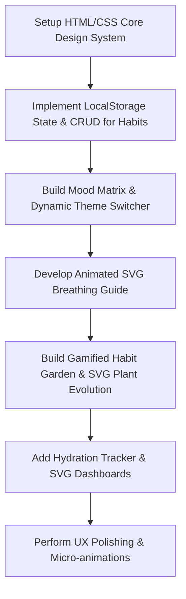

# Product Requirements Document (PRD)
## Project: Haven — Habit Tracker & Ambient Wellness Companion

This document outlines the product requirements, design system, and technical specifications for building **Haven**, a premium, client-side web application designed to balance personal productivity with mental health.

---

## 1. Product Overview & Goal
Haven is an ambient habit tracker and wellness companion. Unlike dry, checkbox-only productivity apps, Haven focuses on user wellness by linking habit tracking with mood logs and breathing exercises in a calming, nature-inspired user interface.

The main goal of this prototype is to showcase:
- High-fidelity visual styling using HSL-tailored forest green, soft sage, and warm sand palettes.
- Fluid, organic micro-interactions and SVG animations.
- Fully local, client-side data persistence (via LocalStorage) for an immediate, zero-friction developer/user testing experience.

---

## 2. Key Features & User Stories

### A. Mood Matrix (Visual Mood & Energy Log)
* **Description**: A grid of color-coded moods representing energy and emotional state. Selecting a mood updates the page theme dynamically and recommends a daily micro-challenge.
* **User Story**: As a user, I want to quickly select how I feel today so the application can match my headspace and recommend appropriate mindfulness actions.
* **Interaction Details**:
  - Grid of mood blocks (e.g., *Radiant, Focused, Tired, Anxious, Calm*).
  - Hover glow effects and a dynamic checkmark animation.
  - Theme shift: Page gradient background adjusts subtly depending on the active mood.

### B. Animated Breathing Guide
* **Description**: A visual mindfulness tool implementing the box-breathing technique (Inhale, Hold, Exhale, Hold) with fluid SVG expand/contract animations.
* **User Story**: As a user, I want to take a quick breathing break to relieve stress and re-center myself.
* **Interaction Details**:
  - Interactive play/pause controller.
  - A central circle that expands and contracts dynamically, synced with text instructions ("Inhale", "Hold", "Exhale").
  - A progress bar or circular ring indicating progress through a 1-minute session.

### C. Gamified Micro-Habit Garden
* **Description**: A habit tracker where each check-off grows a part of a virtual garden.
* **User Story**: As a user, I want to track my daily habits and feel a sense of progress as my habit garden grows.
* **Interaction Details**:
  - Habit items list with custom, custom-styled checkbox components.
  - Completing a habit triggers a particle pop animation and grows a digital plant leaf or flower in an interactive SVG canvas.
  - A progress bar demonstrating completion rate (e.g., 2/5 habits done).

### D. Wellness Analytics & Insights
* **Description**: Elegant mock charts showing streaks, hydration trackers, and weekly sleep insights.
* **User Story**: As a user, I want to see my wellness trends over the past week in a clean, visual representation.
* **Interaction Details**:
  - Streak badges showing consecutive days of habit completion.
  - Interactive hydration tracker (click to log glass of water, filling up a beautiful SVG glass element).
  - Simple, responsive SVG-based charts visualizing historical habit compliance.

---

## 3. UI Design System

### A. Color Palette
Haven uses a calming, nature-derived palette designed to reduce screen strain:
- **Background**: Deep Forest Gradient (from dark spruce `#0b1a16` to deep pine `#062e24`)
- **Cards**: Soft Spruce glassmorphic overlays (`rgba(10, 45, 38, 0.45)` with a `backdrop-filter: blur(16px)` and light border `rgba(255, 255, 255, 0.08)`)
- **Primary Text**: Off-white/Cream (`#f4f6f5`)
- **Secondary Text**: Soft Sage (`#a7f3d0`)
- **Accents**: Warm Sand/Gold (`#f59e0b` / `#fbbf24`) and Active Emerald (`#10b981`)

### B. Typography
- **Headers**: *Playfair Display* or *Outfit* (elegant, organic, premium sans-serif/serif) via Google Fonts.
- **Body**: *Inter* or *Outfit* (highly legible, modern clean letters).

### C. Layout Grid
- **Desktop**: 3-column masonry/dashboard grid (Left: Profile & Mood Matrix, Center: Habit Garden & SVG Plant, Right: Breathing Guide & Hydration Tracker).
- **Mobile**: Single-column responsive layout with smooth swipe transitions or tab bar.

---

## 4. Technical Architecture & Stack

- **Core**: HTML5, Vanilla JavaScript (ES6+), Vanilla CSS3.
- **UI Architecture**: Single Page Application (SPA) structure.
- **Styling**: Modern CSS variables, flexbox, CSS grid, keyframe animations, glassmorphism.
- **Icons**: Inline SVGs or Lucide/Feather icons loaded via CDN.
- **State Management**: Client-side JavaScript state store persisted in `window.localStorage`.
- **Hosting/Dev Server**: Runs locally via static server (e.g., VS Code Live Server or a simple npm script).

---

## 5. Prototype Scope & Implementation Milestones

### Milestone 1: Foundation & CSS Tokens
- Set up boilerplate index.html and index.css with CSS Custom Properties.
- Load Google Fonts and base icons.
- Build the core glassmorphic card layouts.

### Milestone 2: Habit Engine & Dynamic Moods
- Build the core state manager for loading/saving data.
- Implement the habit list (Add, Toggle, Delete).
- Build the Mood Matrix grid; wire it up to shift CSS gradients dynamically.

### Milestone 3: Breathing & Hydration Widgets
- Create the box-breathing SVG layout.
- Write the timing loops and CSS transition rules to expand the circle.
- Write the hydration tracker logic (click to fill glass, animates the liquid rise).

### Milestone 4: Plant Growth & Visual Analytics
- Design a dynamic SVG tree/plant structure whose branches/leaves render based on the percentage of completed habits.
- Integrate the visual metrics chart using responsive SVG path representations.

---

## 6. Verification & Quality Benchmarks
- **Visuals**: No generic colors, smooth borders, backdrop-filters working correctly.
- **Responsiveness**: Fits perfectly on a 1920x1080 desktop screen down to a 375x812 iPhone screen.
- **Smoothness**: Animations (breathing guide, plant growth, checked state) must run at 60 FPS without layout shifts.
- **Persistence**: Reloading the page retains current mood, selected habits, hydration count, and plants.
